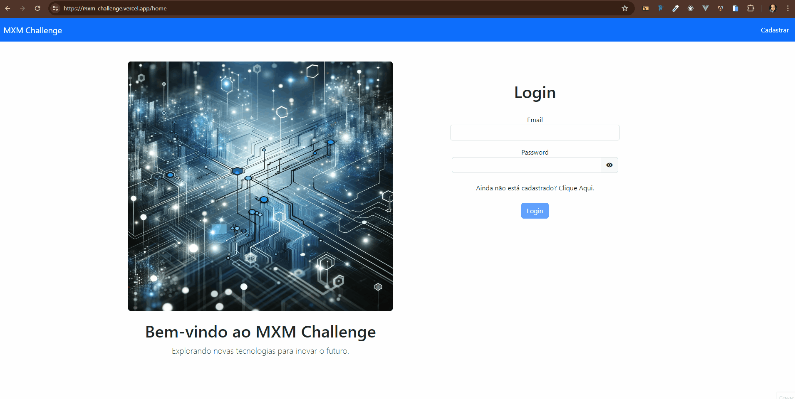

# MXMChallenge

Este projeto foi desenvolvido usando [Angular CLI](https://github.com/angular/angular-cli) version 17.3.3.
Além disso, também foram utilizados a biblioteca ngx-mask para estilizar campos de input, ReactiveForms para aprimorar o uso dos formulários do Angular, e o Bootstrap para permitir um layout mais padronizado.
Quanto a segurança, o aplicativo utiliza um Guard para verificar se o usuário está autenticado e dessa forma permite que o usuário acesse suas informações que foram cadastradas.
Também utilizei um interceptor para adicionar o token aos headers das requisições e dessa forma simplificar as consultas ao backend.
Outro ponto importante são as validações aos campos de input:
- verificação do tamanho do nome do usuário, para evitar que o usuário digite apenas 1 caracter;
- verificação do cep;
- verificação do cpf ou cnpj;
- validação da senha para ter pelo menos uma letra maiuscula, uma letra minúscula, um símbolo e um número.
- validação de confirmação da senha para confirmar que a senha digitada corresponde a senha confirmada.
- validação de número de telefone.

Para as requisições ao backend, criei um service que é conectado a api para que o usuário possa criar, atualizar, listar ou deletar sua conta.
Também utilizei um service para que o usuário faça uma busca direta ao ViaCep para buscar os dados do seu endereço e facilitar o preenchimentos dos campos.





## Getting Started

1 - Clone the project:

```bash
git clone https://github.com/Daaaiii/MXMChallenge.git
```


2 - Install the dependencies:

```bash
npm install
# or
yarn install
# or
pnpm install
# or
bun install
```

3 - Run the development server:

```bash
ng serve

```
## Rodando o servidor localmente

Run `ng serve` for a dev server. Navigate to `http://localhost:4200/`. The application will automatically reload if you change any of the source files.

## Stay in touch

<table>
  <tr>
    <td align="center">
      <a href="https://www.linkedin.com/in/daiane-deponti-bolzan/">
        <br>
        <sub>
          <b>Daiane Bolzan</b>
        </sub>
      </a>
    </td>
  </tr>
</table>
