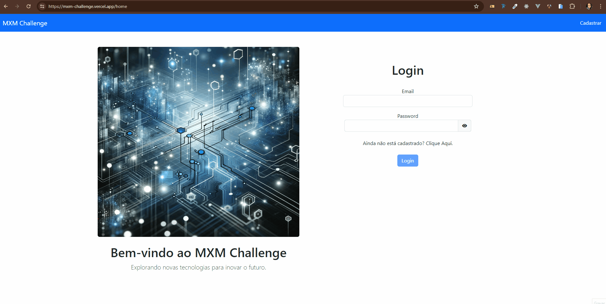

# MXMChallenge

Aplicação Angular 17 para cadastro, autenticação, consulta de CEP via ViaCEP e gerenciamento de perfil.

O projeto usa Angular standalone com SSR, Reactive Forms, `ngx-mask`, Bootstrap Icons, guard de autenticação e interceptor HTTP para enviar o token nas requisições protegidas.

## Funcionalidades

- Login com armazenamento de token no navegador.
- Cadastro com validações de nome, CEP, CPF/CNPJ, senha, confirmação de senha e telefone.
- Busca automática de endereço pelo ViaCEP.
- Perfil protegido por guard de autenticação.
- Exclusão de perfil com confirmação.

## Requisitos

- Node.js `^20.19.0` ou `>=22.12.0` para compatibilidade com Vite 8.
- npm, yarn, pnpm ou bun.

## Como rodar

1. Instale as dependências:

```bash
npm install
```

2. Inicie o servidor de desenvolvimento:

```bash
npm start
```

3. Acesse:

```text
http://localhost:4200/
```

## Scripts

```bash
npm run build
npm test
```

## Roadmap financeiro

O plano de evolução do modulo financeiro esta documentado em [docs/finance-roadmap.md](docs/finance-roadmap.md). As fases futuras devem ser aprovadas separadamente antes da implementação.

## API

A URL da API fica configurada em `src/environments/environment.ts` e `src/environments/environment.prod.ts`.

## Demonstração



## Contato

<table>
  <tr>
    <td align="center">
      <a href="https://www.linkedin.com/in/daiane-deponti-bolzan/">
        <br>
        <sub>
          <b>Daiane Bolzan</b>
        </sub>
      </a>
    </td>
  </tr>
</table>
